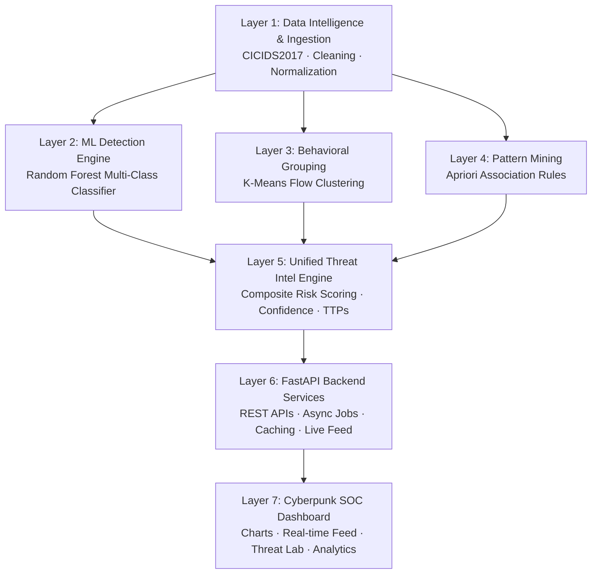

# 🛡️ Cyber Threat Intelligence Platform — Master Documentation & System Guide

---

## 📑 Table of Contents
1. [System Architecture (The 7-Layer Framework)](#1-system-architecture-the-7-layer-framework)
2. [Complete Directory & File Structure](#2-complete-directory--file-structure)
3. [How to Run and Operate the Platform](#3-how-to-run-and-operate-the-platform)
4. [Comprehensive Feature Matrix](#4-comprehensive-feature-matrix)
5. [Complete API Endpoints Reference](#5-complete-api-endpoints-reference)
6. [Task Completion Checklist](#6-task-completion-checklist)
7. [Future Roadmap & Strategic Planning](#7-future-roadmap--strategic-planning)

---

## 1. System Architecture (The 7-Layer Framework)

The platform is designed as an enterprise-grade, end-to-end Cyber Threat Intelligence (CTI) system structured into 7 distinct functional layers:



### Layer Breakdown
- **Layer 1 — Data Intelligence**: Handles raw network flow ingestion, label normalization (mapping 15 raw CICIDS2017 classes to standard tags), infinite/NaN sanitation, statistical distributions, and train/test splitting.
- **Layer 2 — Supervised Detection Engine**: Production-ready Random Forest classifier trained on 78 network flow features, providing multi-class attack probability distributions and feature importance weights.
- **Layer 3 — Unsupervised Behavioral Grouping**: K-Means clustering algorithm that discovers hidden structural groupings in traffic, profiles attack centroids, and tracks anomalous clusters.
- **Layer 4 — Association Rule & Pattern Mining**: Apriori transaction mining extracting co-occurrence relationships among ports, protocols, flags, durations, and attack vectors (e.g., `Port 80 + High SYN -> DoS-Hulk`).
- **Layer 5 — Unified Threat Intelligence Engine**: The correlation core (`src/models/threat_intel.py`) that synthesizes classification, clustering, and association rules into a single composite Threat Score (0–100), risk tier, behavioral context, and recommended mitigation actions.
- **Layer 6 — High-Performance Backend**: Async FastAPI application providing 16 endpoints, non-blocking background model training, in-memory/JSON caching, and fallback synthetic feeds.
- **Layer 7 — Cyberpunk SOC Dashboard**: Responsive HTML5/CSS3/Vanilla JS interface with high-contrast dark theme, Chart.js visualizations, interactive Threat Classifier Lab, Live Security Feed, Cluster Explorer, and Pattern Viewer.

---

## 2. Complete Directory & File Structure

Below is the complete walkthrough of every folder and file in the codebase:

```
Cyber Dashboard/
│
├── .venv/                         # Python Virtual Environment
├── backend/                       # Layer 6: FastAPI Backend Service
│   ├── cache/                     # In-memory / JSON cache directory for fast loads
│   ├── routers/                   # Modular API route controllers
│   │   ├── __init__.py            # Router package init
│   │   ├── analytics.py           # Endpoints for stats, trends, feature importances, model reports
│   │   ├── clusters.py            # Endpoints for K-Means training, status, cluster inspection
│   │   ├── patterns.py            # Endpoints for Apriori rule mining, status, pattern queries
│   │   ├── predict.py             # Endpoints for single/batch RF predictions and live traffic feed
│   │   └── threat_intel.py        # Layer 5 Endpoints for unified multi-engine threat assessment
│   ├── __init__.py                # Backend package init
│   └── app.py                     # Main FastAPI application entry point & static file server
│
├── data/                          # Data Storage & Processing Cache
│   ├── processed/                 # Processed dataset caches
│   │   ├── attack_trends.json     # Precomputed hourly attack trends for instant dashboard load
│   │   └── label_distribution.json# Precomputed label statistics across 2.8M flows
│   └── raw/                       # Raw CICIDS2017 CSV files (e.g., combinenew.csv)
│
├── frontend/                      # Layer 7: Cyberpunk SOC Dashboard UI
│   ├── css/
│   │   └── dashboard.css          # Cyberpunk styling, glassmorphism, responsive grid & animations
│   ├── js/
│   │   ├── api.js                 # Frontend API client with fallback mock datasets
│   │   ├── charts.js              # Chart.js renderers (Donut, Area Trends, Feature Bar, Bubble)
│   │   └── main.js                # Core dashboard controller, live feed polling, form handlers
│   └── index.html                 # Single-page SOC management interface
│
├── model/                         # Layer 2 & 3: Serialized Model Artifacts
│   ├── feature_columns.json       # Ordered list of feature names expected by the model
│   ├── label_encoder.pkl          # LabelEncoder for mapping class names to integer IDs
│   ├── random_forest.pkl          # Serialized Random Forest classifier
│   ├── scaler.pkl                 # StandardScaler fitted on network features
│   ├── kmeans.pkl                 # (Auto-generated) Serialized K-Means clustering model
│   └── cluster_profiles.json      # (Auto-generated) Centroid and label profiles for clusters
│
├── notebooks/                     # Exploratory & Experimental Jupyter Notebooks
│   ├── 01_baseline_modeling.ipynb     # Logistic Regression vs Decision Trees baseline
│   ├── 02_eda_security_analysis.ipynb # Statistical EDA, port profiling, protocol breakdowns
│   ├── 03_random_forest_detection.ipynb # RF hyperparameter tuning, ROC-AUC, confusion matrices
│   ├── 04_kmeans_attack_clustering.ipynb # Elbow curve, silhouette scores, centroid interpretations
│   └── 05_apriori_attack_patterns.ipynb  # Apriori transaction construction and rule extraction
│
├── reports/                       # Auto-generated Evaluation Reports
│   ├── model_report.json          # Precision, recall, f1-score, and support per attack class
│   └── confusion_matrix.json      # (Optional) Precomputed confusion matrices
│
├── src/                           # Core Source Code & ML Pipeline
│   ├── data/
│   │   ├── __init__.py
│   │   ├── loader.py              # Robust CSV loader with auto-sampling & column sanitization
│   │   └── preprocessing.py       # NaN handling, infinite float replacement, label mapping
│   ├── evaluation/
│   │   ├── __init__.py
│   │   └── metrics.py             # Evaluation metrics, per-class stats, confusion matrix builders
│   ├── features/
│   │   ├── __init__.py
│   │   └── engineering.py         # Ratio features, flow rate calculation, feature selection
│   ├── models/
│   │   ├── __init__.py
│   │   ├── apriori.py             # Apriori transaction extraction and association rule mining
│   │   ├── kmeans.py              # K-Means clustering, centroid profiling, network statistics
│   │   ├── random_forest.py       # Random Forest model wrapper, loading, prediction, feature importances
│   │   └── threat_intel.py        # Layer 5: Unified Threat Intelligence & Assessment Engine
│   ├── predict.py                 # Standalone CLI prediction utility
│   └── train_random_forest.py     # End-to-end training script for Random Forest pipeline
│
├── tests/                         # Automated Unit & Integration Tests
│   ├── __init__.py
│   ├── test_api.py                # FastAPI route tests using Starlette TestClient
│   └── test_models.py             # Unit tests for RF, K-Means, Apriori, and Threat Intel modules
│
├── .gitignore                     # Git ignore rules for models, venv, and large CSVs
├── cicids2017.ipynb               # Legacy master notebook
├── create_notebooks.py            # Utility script to generate modular educational notebooks
├── eda_security_analysis.ipynb    # Security analysis exploratory notebook
├── PROJECT_OVERVIEW.md            # This comprehensive master documentation
├── README.md                      # High-level overview and quick start guide
└── requirements.txt               # Pinned Python package dependencies
```

---

## 3. How to Run and Operate the Platform

### Prerequisites
- **Python 3.9+** (Python 3.10 or 3.11 recommended)
- **RAM**: Minimum 8 GB (16 GB recommended for full dataset training)
- **Disk Space**: ~2 GB for dataset and virtual environment

---

### Step 1: Clone & Environment Setup

```bash
# 1. Open terminal in the project directory
cd "e:\Cyber Dashboard"

# 2. Activate virtual environment
# On Windows (PowerShell):
.\.venv\Scripts\Activate.ps1
# On Windows (CMD):
.\.venv\Scripts\activate.bat
# On Linux/macOS:
source .venv/bin/activate

# 3. Install required dependencies
pip install -r requirements.txt
```

---

### Step 2: Data Placement

Place the CICIDS2017 dataset CSV in the `raw/` directory:
```
e:\Cyber Dashboard\raw\combinenew.csv
```
*Note: If no dataset is present, the dashboard automatically operates in **Demonstration Mode** using precomputed statistical caches and synthetic stream generators.*

---

### Step 3: Train the Machine Learning Pipeline

#### A. Train Random Forest (Layer 2)
```bash
python src/train_random_forest.py
```
This script performs:
1. Streamlined data loading and cleaning
2. Feature scaling with `StandardScaler`
3. Multi-class Random Forest training
4. Saving artifacts to `model/` (`random_forest.pkl`, `scaler.pkl`, `label_encoder.pkl`, `feature_columns.json`)
5. Outputting performance metrics to `reports/model_report.json`

#### B. Precompute Behavioral Clusters (Layer 3) & Pattern Mining (Layer 4)
*You can trigger K-Means and Apriori training directly via the backend API or SOC dashboard UI.*

---

### Step 4: Start the Backend & Dashboard Server

```bash
# Option A: Run directly via Python
python backend/app.py

# Option B: Run via Uvicorn
uvicorn backend.app:app --host 0.0.0.0 --port 8000 --reload
```

---

### Step 5: Access the Interfaces

| Service | URL | Description |
|---|---|---|
| 🌐 **Cyberpunk SOC Dashboard** | [http://localhost:8000](http://localhost:8000) | Full visual operations center |
| 📖 **Interactive Swagger Docs** | [http://localhost:8000/docs](http://localhost:8000/docs) | Test every endpoint interactively |
| 📑 **ReDoc Documentation** | [http://localhost:8000/redoc](http://localhost:8000/redoc) | Clean API schema reference |

---

### Step 6: Running Automated Tests

Run the complete test suite to verify ML models and API routes:

```bash
# Run all unit and integration tests
pytest tests/ -v

# Run with coverage report
pytest --cov=src --cov=backend tests/
```

---

## 4. Comprehensive Feature Matrix

### 🎯 Supervised Threat Detection (Random Forest)
- **15-Class Detection**: Accurately detects `BENIGN`, `DDoS`, `DoS Hulk`, `DoS GoldenEye`, `DoS slowloris`, `DoS Slowhttptest`, `PortScan`, `FTP-Patator`, `SSH-Patator`, `Bot`, `Web Attack - Brute Force`, `Web Attack - XSS`, `Web Attack - Sql Injection`, `Infiltration`, `Heartbleed`.
- **Confidence Scoring**: Returns prediction probabilities for all classes.
- **Top Feature Attribution**: Calculates feature importance rankings across all 78 network flow metrics.

### 🔵 Unsupervised Behavioral Grouping (K-Means)
- **Centroid Profiling**: Automatically labels clusters based on dominant attack types, port concentrations, and packet velocity.
- **Protocol & Port Distribution**: Identifies top destination ports (e.g., Port 80, 443, 22, 21) and dominant protocols per cluster.
- **Async Training**: Non-blocking background worker allows real-time cluster retuning with custom $k$ values ($k=3$ to $k=15$).

### 🧩 Association Rule & Pattern Mining (Apriori)
- **Attack Signature Correlation**: Mines frequent itemsets connecting port numbers, flow rates, duration brackets, and TCP flags with specific attack classes.
- **Metric Filtering**: Computes Support, Confidence, and Lift for every discovered rule.
- **Interactive Querying**: Filter top $N$ rules sorted by Confidence or Lift.

### 🛡️ Unified Threat Intelligence Engine (Layer 5)
- **Composite Threat Score (0–100)**: Formulated from ML confidence, attack severity weighting, behavioral cluster context, and rule-matching bonuses.
- **Severity Classification**: Maps composite risk into `CRITICAL`, `HIGH`, `MEDIUM`, `LOW`, and `BENIGN`.
- **Recommended Action Dispatch**: Supplies actionable SOC defense steps (e.g., "Enforce rate limiting on port 80", "Isolate host and rotate SSH credentials").

### 📊 SOC Visualizations & Analytics
- **Threat Level Gauge**: Visual indicator of immediate network danger.
- **Live Traffic Feed**: Simulated/live streaming log with severity badges and instant inspect modal.
- **Hourly Attack Trends**: Area chart displaying historical attack volume over a 24-hour cycle.
- **Attack Distribution Donut**: Breakdown of attack types across the dataset.
- **Interactive Threat Classifier Lab**: Form allowing SOC analysts to manually inject flow parameters and receive immediate threat intel reports.

---

## 5. Complete API Endpoints Reference

All endpoints return JSON responses.

### 📡 System & Core Routes
| Method | Endpoint | Description | Query / Body Params |
|---|---|---|---|
| `GET` | `/` | Serves the frontend SOC Dashboard | None |
| `GET` | `/health` | System health check and model loading status | None |

---

### 📊 Analytics & Reporting Routes (`/api/...`)
| Method | Endpoint | Description | Query / Body Params | Response Structure |
|---|---|---|---|---|
| `GET` | `/api/stats` | Dataset overview and class distribution | None | `{ total_flows, attack_count, benign_count, label_distribution: {} }` |
| `GET` | `/api/trends` | Hourly attack trend statistics | None | `{ hours: [], datasets: [{ label, data }] }` |
| `GET` | `/api/model-report` | Per-class Precision, Recall, F1 metrics | None | `{ accuracy, per_class: { ... }, macro_avg, weighted_avg }` |
| `GET` | `/api/features` | Top-N Random Forest feature importances | `top_n` (int, default: 15) | `{ features: [{ feature, importance }] }` |

---

### 🎯 Supervised Prediction Routes (`/api/...`)
| Method | Endpoint | Description | Request Body | Response Structure |
|---|---|---|---|---|
| `POST` | `/api/predict` | Classify single network flow | `{"features": { "Destination Port": 80, ... }}` | `{ prediction, confidence, probabilities: {}, threat_level }` |
| `GET` | `/api/live-feed` | Fetch latest threat stream records | `limit` (int, default: 20) | `{ feed: [{ timestamp, source_ip, attack_type, severity, confidence }] }` |

---

### 🔵 Behavioral Clustering Routes (`/api/clusters/...`)
| Method | Endpoint | Description | Parameters | Response Structure |
|---|---|---|---|---|
| `GET` | `/api/clusters` | Retrieve cached K-Means cluster profiles | None | `{ clusters: [{ cluster_id, size, dominant_label, network_profile }] }` |
| `POST` | `/api/clusters/train` | Trigger background K-Means clustering | `k` (int, default: 8), `sample_size` (int) | `{ status: "started", message: "Training initiated" }` |
| `GET` | `/api/clusters/status`| Poll background clustering job status | None | `{ status: "idle" \| "training" \| "completed" \| "failed", progress }` |

---

### 🧩 Association Patterns Routes (`/api/patterns/...`)
| Method | Endpoint | Description | Parameters | Response Structure |
|---|---|---|---|---|
| `GET` | `/api/patterns` | Retrieve discovered Apriori rules | `top_n` (int, default: 20), `min_lift` (float) | `{ rules: [{ antecedents, consequents, support, confidence, lift }] }` |
| `POST` | `/api/patterns/mine` | Trigger background Apriori mining | `min_support` (float), `min_confidence` (float) | `{ status: "started", message: "Mining initiated" }` |
| `GET` | `/api/patterns/status`| Poll background pattern mining job status | None | `{ status: "idle" \| "mining" \| "completed" \| "failed" }` |

---

### 🛡️ Layer 5: Threat Intelligence Engine Routes (`/api/threat-intel/...`)
| Method | Endpoint | Description | Request / Query | Response Structure |
|---|---|---|---|---|
| `POST` | `/api/threat-intel/assess` | Unified assessment of a single flow | `{"features": { ... }}` | `{ threat_score: 87.5, threat_level: "CRITICAL", classification: { ... }, cluster_context: { ... }, matching_rules: [], recommendations: [] }` |
| `POST` | `/api/threat-intel/assess-batch` | Batch assessment of multiple flows | `{"flows": [{ ... }]}` | `{ assessments: [...], batch_summary: { avg_score, critical_count } }` |
| `GET` | `/api/threat-intel/summary` | Global threat landscape summary | None | `{ active_threats_count, average_risk_score, top_targeted_ports, top_attack_types }` |
| `POST` | `/api/threat-intel/reset` | Reload models and reset in-memory caches | None | `{ status: "success", message: "Threat intel engine reloaded" }` |

---

## 6. Task Completion Checklist

| Layer | Component | Status | Details |
|---|---|:---:|---|
| **Layer 1** | Data Loader (`src/data/loader.py`) | ✅ Complete | Robust CSV reading, chunking, stratified sampling |
| **Layer 1** | Preprocessing (`src/data/preprocessing.py`) | ✅ Complete | NaN sanitation, Inf cleanup, LabelEncoder integration |
| **Layer 1** | EDA Security Analysis (`eda_security_analysis.ipynb`) | ✅ Complete | Port analysis, class imbalance, protocol correlations |
| **Layer 2** | Random Forest Wrapper (`src/models/random_forest.py`) | ✅ Complete | Full inference engine, feature importances, model serialization |
| **Layer 2** | RF Training Script (`src/train_random_forest.py`) | ✅ Complete | Automated training, model artifact generation, report saving |
| **Layer 3** | K-Means Engine (`src/models/kmeans.py`) | ✅ Complete | Centroid profiling, security interpretation, network statistics |
| **Layer 3** | K-Means Background Worker (`backend/routers/clusters.py`) | ✅ Complete | Async background thread execution, job polling |
| **Layer 4** | Apriori Engine (`src/models/apriori.py`) | ✅ Complete | Enriched transaction builder (rates, durations, ports, flags) |
| **Layer 4** | Apriori Mining Worker (`backend/routers/patterns.py`) | ✅ Complete | Async mining thread execution, rule ranking by lift |
| **Layer 5** | Threat Intel Engine (`src/models/threat_intel.py`) | ✅ Complete | Multi-model correlation, 0-100 risk score, mitigation advisor |
| **Layer 5** | Threat Intel Router (`backend/routers/threat_intel.py`) | ✅ Complete | Endpoints for single flow, batch flow, landscape summary |
| **Layer 6** | FastAPI Server (`backend/app.py`) | ✅ Complete | Unified app, CORS middleware, `/health`, static mount, router inclusion |
| **Layer 6** | API Client (`frontend/js/api.js`) | ✅ Complete | Complete fetch bindings with graceful demo fallback |
| **Layer 7** | 5-Screen Cyberpunk SPA (`frontend/index.html`) | ✅ Complete | 5-tab modular UI (Overview, Analytics, ML Detection, Clusters, Patterns) |
| **Layer 7** | Cyberpunk Design System (`frontend/css/dashboard.css`) | ✅ Complete | Neon glowing dark mode, glassmorphism, responsive grid, tab animations |
| **Layer 7** | Charts & Visualizations (`frontend/js/charts.js`) | ✅ Complete | Donut, multi-line trends, feature bars, cluster bubble, port bars, protocol radar |
| **Layer 7** | UI Controller (`frontend/js/main.js`) | ✅ Complete | 5-screen orchestrator, live feed ticker, threat assessment lab, interactive job polling |
| **Testing** | Model Unit Tests (`tests/test_models.py`) | ✅ Complete | Automated tests for RF, K-Means, Apriori, and Threat Intel |
| **Testing** | API Integration Tests (`tests/test_api.py`) | ✅ Complete | Full route coverage using FastAPI TestClient (24/24 passing) |


---

## 7. Future Roadmap & Strategic Planning

```mermaid
gantt
    title Cyber Threat Intelligence Platform Evolution Roadmap
    dateFormat  YYYY-Q#
    section Phase 1: Real-time Ingestion
    Live PCAP Sniffer (Scapy/DPKT)        :done, 2026-Q1, 2026-Q2
    Kafka / Redis Stream Ingestion       :active, 2026-Q2, 2026-Q3
    section Phase 2: Advanced AI
    SMOTE Class Balancing Pipeline       :2026-Q3, 2026-Q4
    Graph Neural Networks for Botnets    :2026-Q4, 2027-Q1
    section Phase 3: SOC Automation
    MITRE ATT&CK Matrix Auto-Mapping     :2027-Q1, 2027-Q2
    Automated SIEM & Webhook Dispatch    :2027-Q2, 2027-Q3
```

### Phase 1: Real-time Packet Ingestion & Network Sniffing
- **Live PCAP Sniffer Engine**: Implement a Python `scapy`/`dpkt` capture daemon that reconstructs bidirectional TCP/UDP flows in real-time from network interfaces (e.g. `eth0`, `wlan0`) and computes the 78 CICFlowMeter statistical features on the fly.
- **Message Broker Integration**: Deploy Apache Kafka or Redis Streams to handle 50,000+ flows per second from distributed sensor nodes.

### Phase 2: Advanced Machine Learning & Threat Adaptation
- **SMOTE & Rare Attack Oversampling**: Implement automated SMOTE and ADASYN in `src/data/preprocessing.py` to boost detection rates for ultra-rare classes (e.g., `Heartbleed`, `Infiltration`, `Sql Injection`).
- **Graph Neural Networks (GNN)**: Build graph-based threat models tracking lateral movement and command-and-control (C2) botnet topologies across IP subnets.
- **Continuous Concept Drift Detection**: Deploy Kolmogorov-Smirnov statistical tests to detect when network traffic patterns deviate from baseline, automatically scheduling retraining jobs.

### Phase 3: SOC Automation & Enterprise Integrations
- **MITRE ATT&CK Matrix Mapping**: Automatically map detected attack categories and Apriori patterns to standard MITRE ATT&CK Techniques & Tactics (e.g., T1046 - Network Service Discovery, T1498 - Network Denial of Service).
- **Automated Incident Response Webhooks**: Dispatch automated webhook notifications to Slack, Microsoft Teams, Discord, PagerDuty, and enterprise SIEMs (Splunk, Elastic SIEM, Microsoft Sentinel).
- **Automated Firewall Rule Generation**: Generate instant `iptables`, `nftables`, or AWS Security Group ACL rules based on high-confidence threat assessments.

---

*Last Updated: September 2026 • Cyber Threat Intelligence Dashboard Team*
